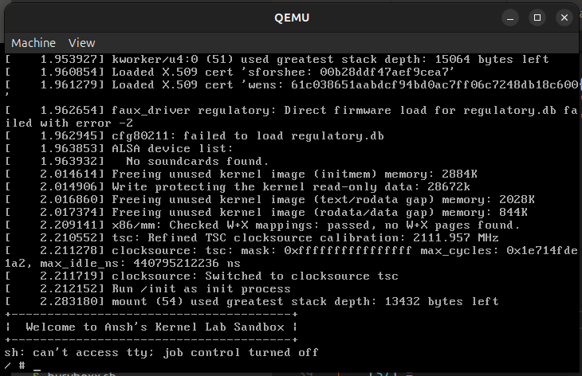
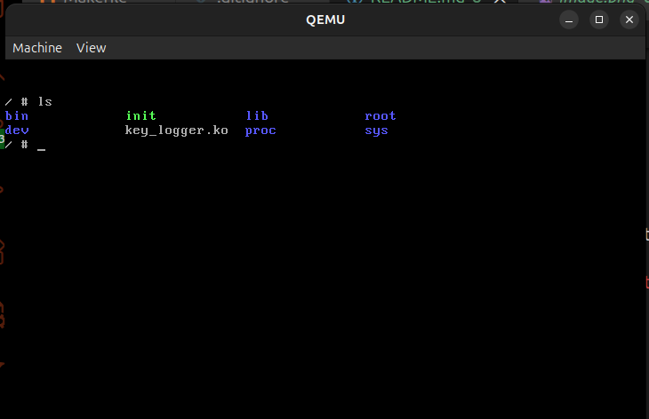

# LINUX KERNEL PROJECTS

Contains several mini projects under the roof of **Linux Kernel**. Some of them are: -

1\. `Periodic Blinker`:

2\. `Character Device`:

3\. `Process Stats`:

4\. `Virtual Stack`:

5\. `Virtual Queue`:

6\. `Key Logger`:


## About

These projects utilize a custom built kernel, designed over `Linux 6.18.3`, using `BusyBox` version `1.34.1` ans `Qemu`. This custom kernel is used here to run all the programs rather than using the PC's kernel.

I have made use of `struct file_operations` to perform operations such as `read()`, `write()`, `open()`, `release()`, etc...

The `Key Logger` project makes use of `struct notifier_block` besides `struct file_operations` structure to detect keyboard movements and logging the info.

These projects also make use of several linux header files, to execute the required operations. Wich are included into the main file using same syntax as in C. Some of them are as follows:

```cpp
#include <linux/init.h>
#include <linux/fs.h>
#include <linux/kthread.h>
#include <linux/kernel.h>
#include <linux/module.h>
#include <linux/uaccess.h>
#include <linux/keyboard.h>
```

## Execution

The execution process is quite simple.

Suppose if the target C file is named as `target.c`, then in the `Makefile` name the `MODULE_NAME` as `target`. In the `temp.sh` file change the name for kernel object file name as `target.ko`. 

No in the present directory run the command make:

```bash
make
```

A window opens as in the image:


This works as a mini linux shell. Almost all the linux commands such as `ls`, `clean`, `cat`, etc.. runs here.

Try executing `ls`:



Not to insert the `ko` file run the command:

```bash
insmod target.ko
```

check the message generated by the kernel using the command:
```bash
dmesg | tail -n5
```

The last line must show a success message with character number with it, for now let the character number be 247. Now to make a node enter:

```bash
mknod /dev/name_u_like c 247 0
```

